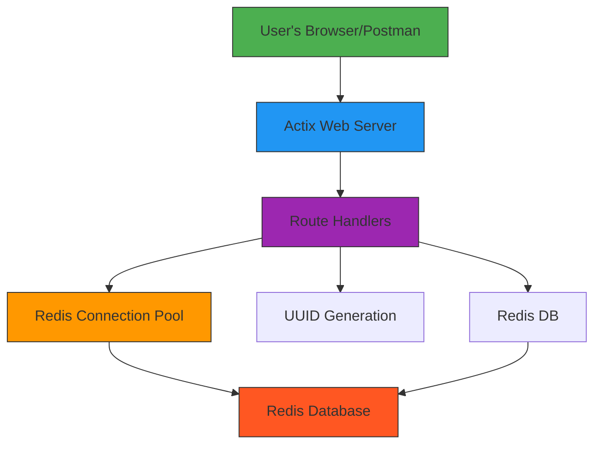

# 🔗 URL Shortener Service

A simple and fast URL shortening service built with **Rust**, **Actix Web**, and **Redis**.

## 🚀 Features

- 📦 Create short links from long URLs
- ↪️ Redirect to the original URL using a short code
- 📊 Retrieve URL statistics (creation date, access count)
- 🗑️ Delete shortened URLs

## 🛠 Tech Stack

- [Rust](https://www.rust-lang.org/)
- [Actix Web](https://actix.rs/)
- [Redis](https://redis.io/)
- [serde / serde_json](https://docs.rs/serde/)
- [uuid](https://docs.rs/uuid/)

## 📦 Installation

1. Make sure Redis is installed and running locally (`localhost:6379` by default).
2. Clone the repository:

```bash
git clone https://github.com/your-username/url-shortener.git
cd url-shortener 
```
3. Create a .env file:

```
BASE_URL=https://yourdomain.com
REDIS_URL=redis://127.0.0.1/
```
4. Run the project:


```bash
cargo run
```

## 📚 API Endpoints
### POST /shorten
Creates a shortened URL.

Request Example:

```json
{
  "url": "https://example.com/some/very/long/link"
}

```
Response:

```json
{
  "short_url": "https://yourdomain.com/7e6c9f42-7d44-46a3-81fd-9e86b3025cb0"
}

```
### GET /{short_code}
Returns the original URL and increments the access counter.

Response:

https://example.com/some/very/long/link

### DELETE /{short_code}
Deletes a shortened URL.

URL successfully deleted

### GET /{short_code}/stats
Returns statistics about the shortened URL.

Response:

```json
{
  "id": 0,
  "url": "https://example.com/some/very/long/link",
  "created_at": "2024-04-04T15:00:00Z",
  "updated_at": "2024-04-05T10:00:00Z",
  "access_count": 5
}
```

## 🗺️ Architecture Diagram


